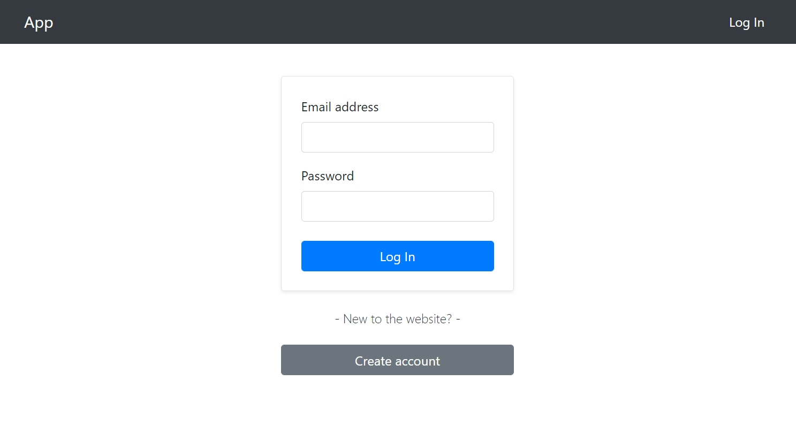

# **Registration and Login System** _(Backend & Frontend)_ :key:

### User Registration and Login System using [Node.js](https://nodejs.org/en/), [Express](https://expressjs.com/), [MongoDB](https://www.mongodb.com/), [React](https://reactjs.org/docs/create-a-new-react-app.html) and [JWT](https://www.npmjs.com/package/jsonwebtoken).

- Server  
    ~~~
    - Dependencies: express, mongoose, jsonwebtoken, bcryptjs, cors, dotenv
    - DevDependencies: nodemon
    ~~~
    
- Client
    ~~~
    - Dependencies: react-router-dom, axios, bootstrap 
    ~~~
 
#

### Screenshot

